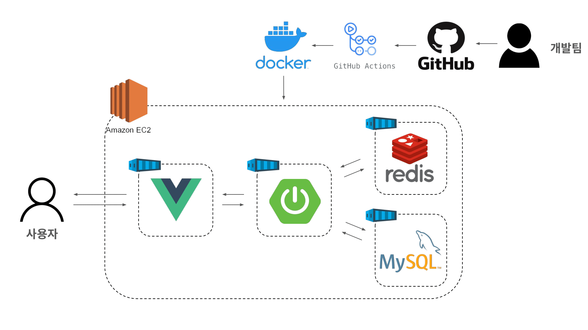
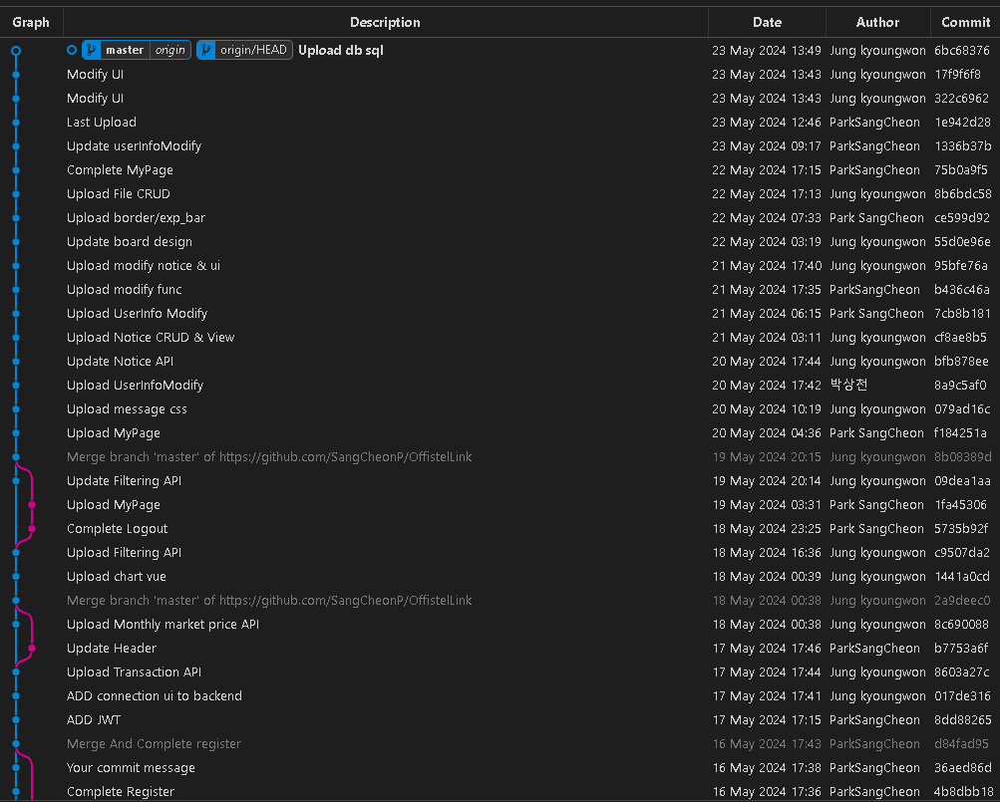
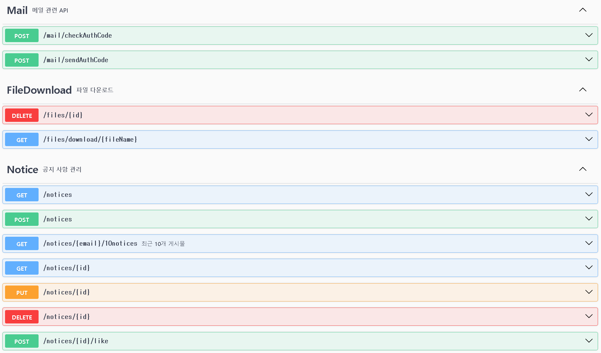
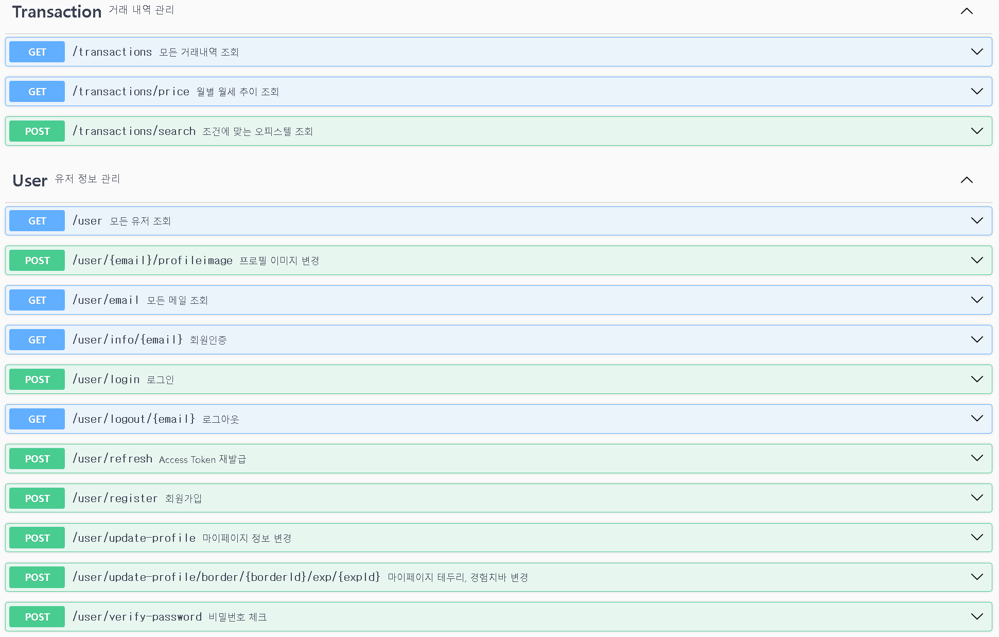
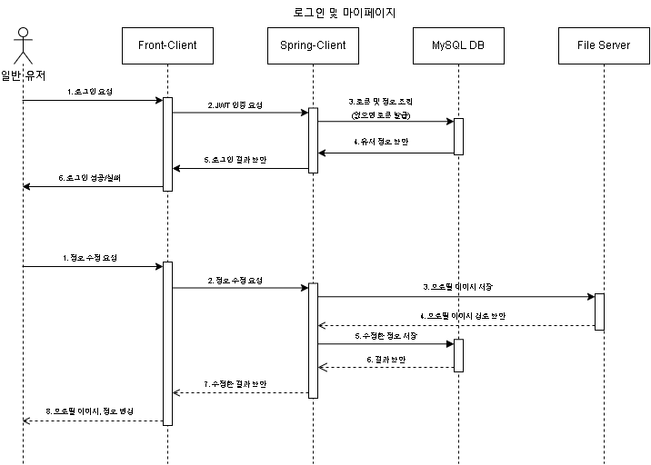
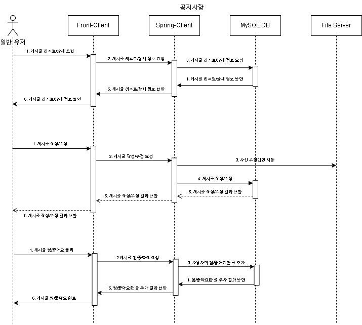

# OfficetelLink

### :bulb: 시연 영상

↑ 클릭하면 시연 영상을 볼 수 있습니다!

## 🚩 목차

1. 기획 배경
2. 서비스 소개
3. 기능 소개
4. 시연
5. 기술 스택
6. 프로젝트 일정 및 기타 산출물

## :sparkles: 기획 배경

#### 개요

- 한 줄 설명 : 대학생과 사회 초년생을 위한 오피스텔 월세 '정보 제공 서비스'
- 서비스 명 : **OfficetelLink**

#### 목적
- **오피스텔 월세 정보 제공**
- 원하는 지역의 오피스텔 평균 월세 시세 정보를 제공하여, 원하는 가격대의 오피스텔을 찾도록 돕는다.

#### 현 상황
- 많은 사람들이 주거비 부담을 줄이기 위해 마이너스 통장을 사용하거나 기숙사와 쉐어하우스로 이동. [원룸 월세 100만원 시대, 청년들의 주거 대책](https://news.tvchosun.com/site/data/html_dir/2024/04/30/2024043090158.html)
- 전세 기피와 전세대출 금리 상승으로 울산 소형 오피스텔 월세가 9개월 연속 상승. [소형 오피스텔 월세 9개월 연속 상승, 청년층 주거비 부담 가중](http://www.ujeil.com/news/articleView.html?idxno=344092)
- 전세 사기와 비아파트 공급 감소로 서울의 초소형 오피스텔 월세가 100만원을 넘어섬. [초소형 오피스텔 월세 100만원 돌파, 청년층 주거비 부담 심화](https://www.khan.co.kr/economy/real_estate/article/202402221635001)
- 울산의 대학생들이 개강을 앞두고 학자금, 물가, 월세의 '3중고'로 어려움을 겪음. [울산 대학생들, 학자금·물가·월세 '3중고'로 생활고 호소](https://www.domin.co.kr/news/articleView.html?idxno=1454691)

## :sparkles: 서비스 소개

#### 페르소나

- 관리자 : **서비스 관리자**

    - **오피스텔 정보 관리** : 모든 오피스텔의 정보(월세, 위치, 계약금 등)를 확인할 수 있습니다.
    - **게시글 관리** : 게시글을 추가, 수정, 삭제할 수 있습니다.
    - **상점 목록 관리** : 현재 테두리 및 경험치바 외에도 다양한 상점 목록을 추가하여 제공할 수 있습니다.

- 일반 사용자 : **대학생** 및 **사회 초년생**

    - **오피스텔 정보 확인** : 위치를 선택하여 원하는 지역의 오피스텔 정보를 확인할 수 있습니다.
    - **게시글 관리** : 게시글을 추가, 수정, 삭제하고, 다른 사람의 게시글에 댓글을 남길 수 있습니다.
    - **포인트 및 EXP 획득**: 출석체크 및 추천을 받아 포인트와 EXP를 얻을 수 있습니다.
    - **프로필 꾸미기** : 얻은 포인트로 상점에서 테두리와 EXP바를 구매해 프로필을 꾸밀 수 있습니다.

#### 기대 효과

- **지역별 오피스텔 평균 월세와 비교** : 사용자가 자신에게 적합한 월세를 선택할 수 있습니다.
- **게시판을 통한 정보 제공** : 데이터에 없는 집에 대한 정보를 공유할 수 있습니다.
- **포인트와 EXP를 통한 게시판 활성화** : 게시판 활동을 촉진하여 사용자 참여를 높입니다.

## :sparkles: 기능 소개

- **메인 페이지 기능**
    
    - **지도 화면 구현**: 국토교통부 대전 오피스텔 실거래가 정보와 카카오맵 API를 활용하여 해당 지역을 지도에 마커 및 클러스터로 표시합니다.
    - **오피스텔 실거래가 검색**: 구, 동, 도로명 주소를 활용하여 원하는 지역의 오피스텔 정보를 조회할 수 있습니다.
    - **월별 시세 추이 파악**: 지도 좌측에 월별 오피스텔 실거래가 평균을 차트 형태로 나타냅니다.

- **마이 페이지 기능**
 
    - **회원가입**
    - **회원 정보 수정**: 프로필 이미지와 테두리, 기존 인적 사항을 변경할 수 있습니다.
    - **로그인 & 로그아웃**: JWT Token을 사용하여 로그인 및 로그아웃이 가능합니다.
    - **최근 게시글 및 댓글 조회**: 마이 페이지 하단에 자신이 작성한 게시글과 댓글 링크가 리스트 형태로 나타나며, 사용자는 자신이 작성한 게시글과 댓글 링크로 이동할 수 있습니다.
    - **게시글 저장**: 사용자는 유용하다고 생각하거나 나중에 보기 위한 게시글을 저장하여, 링크를 통해 해당 게시글로 이동할 수 있습니다.

- **게시판 기능**

   - **게시글 조회**: 게시글 추천 가능, 조회수 자동 증가.
   - **게시글 등록**
   - **파일 첨부, 삭제**
   - **게시판 페이징 기능**
   - **게시글 수정, 삭제**:
      
      - 관리자: 모든 회원의 게시글을 수정 및 삭제 가능하며, 관리자 게시글은 상단에 자동으로 고정됩니다.
      - 사용자: 본인의 게시글만 수정 및 삭제 가능합니다.

- **상점 기능(기능 추후 구현 예정)**
    
    - **테두리 치장**: 본인이 작성한 게시글의 추천수 등을 바탕으로 획득한 포인트 또는 경험치로 마이 페이지 테두리를 꾸밀 수 있습니다.

## :sparkles: 기술 스택

- 프론트엔드 : Bootstrap 5.3.3, Vue 3.4.21
- 백엔드 : Amazon Corretto Java 17.0.9, Spring boot 3.2.5, MyBatis 3.0.3, Swagger 2.4.0, MySQL 8.0.37
- CI/CD : GitHub Actions, Docker, AWS EC2
- 이슈관리 : GitHub, MatterMost

#### Architecture 설계도

## :sparkles: 프로젝트 일정 및 기타 산출물

### Git Flow

### API Interface

### Usecase

##### 기본 관리 유스케이스

##### 오피스텔 관리 유스케이스

##### 게시판 관리 유스케이스

### ERD

### Class Diagram

### Sequence Diagram

#### 로그인 및 마이페이지

#### 공지사항

### Screen Design

##### Main 화면

##### 마이페이지 화면

##### 회원 정보 수정 화면

##### 게시판 조회 

##### 게시판 등록

##### 게시판 수정

##### 게시판 세부 사항

##### 상점

## :sparkles: 팀원 소개 및 회고

**Team Name**

원천징수(源泉徵收)

**Ground Rules**
- 매일 아침에  오늘 할 일, 어제 한 일(코드리뷰기반)을 공유한다.

- 주말은 자율적, 하지만 주간 일정을 다 못했다면 주에도 마무리한다.

- 개인 일정은 일정이 잡힌 날 카카오톡과 MatterMost로 미리 공유한다.

- 모르는 부분, 에러난 부분 숨기지말고, 솔직하게 말한다.

**Mind Set**
- 해보고 싶은게 있으면 주저하지 말고 꼭!!! 말한다.

- 적극적으로 팀원들과 소통한다.

- 오프라인에서 최선을 다한다. (200% 역량을 발휘하자!)

- 생각하면서 코딩하기

- 서로 존중한다.

**Retrospect**
- [정경원](https://github.com/kw99j10) : 

- [박상천](https://github.com/SangCheonP) : 
